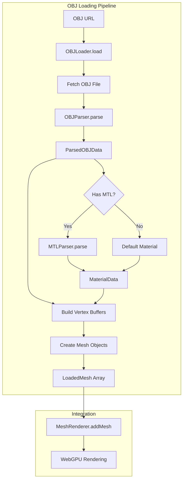

# Design Document: OBJ Loader

## Overview

本设计文档描述 OBJ 格式模型加载器的技术实现方案。OBJLoader 将遵循现有 GLBLoader 的架构模式，提供与现有渲染系统无缝集成的能力。

核心设计原则：
- 与 GLBLoader 保持一致的 API 和数据结构
- 复用现有的 Mesh、MeshRenderer 和 MaterialData 类型
- 支持 OBJ 格式的核心特性（顶点、法线、UV、面、材质）
- 渐进式错误处理，最大化兼容性

## Architecture



### 模块划分

```
src/loaders/
├── GLBLoader.ts      # 现有 GLB 加载器
├── OBJLoader.ts      # OBJ 加载器（新增）
├── OBJParser.ts      # OBJ 文本解析器（新增）
└── MTLParser.ts      # MTL 材质解析器（新增）
```

## Components and Interfaces

### OBJParser

负责解析 OBJ 文件文本内容，提取几何数据。

```typescript
/**
 * 解析后的 OBJ 数据结构
 */
interface ParsedOBJData {
  objects: ParsedObject[];
}

/**
 * 单个对象/组的数据
 */
interface ParsedObject {
  name: string;
  positions: number[];      // 展开后的顶点位置 [x,y,z, x,y,z, ...]
  normals: number[];        // 展开后的法线 [nx,ny,nz, ...]
  uvs: number[];            // 展开后的 UV [u,v, u,v, ...]
  indices: number[];        // 三角形索引
  materialName: string | null;
}

/**
 * OBJ 文本解析器
 */
class OBJParser {
  /**
   * 解析 OBJ 文本内容
   * @param text OBJ 文件文本
   * @returns 解析后的数据结构
   */
  parse(text: string): ParsedOBJData;
}
```

解析流程：
1. 按行分割文本
2. 收集全局顶点池（v, vt, vn）
3. 按 o/g 指令分割对象
4. 解析面数据，展开索引为实际顶点数据
5. 三角化多边形面

### MTLParser

负责解析 MTL 材质文件。

```typescript
/**
 * 解析后的材质数据
 */
interface ParsedMaterial {
  name: string;
  diffuseColor: [number, number, number];  // Kd
  diffuseTexture: string | null;           // map_Kd
  opacity: number;                          // d 或 1-Tr
}

/**
 * MTL 文本解析器
 */
class MTLParser {
  /**
   * 解析 MTL 文本内容
   * @param text MTL 文件文本
   * @returns 材质名称到材质数据的映射
   */
  parse(text: string): Map<string, ParsedMaterial>;
}
```

### OBJLoader

主加载器类，协调解析和 GPU 资源创建。

```typescript
import { Mesh, MeshBoundingBox } from '../mesh/Mesh';
import { MaterialData, LoadedMesh } from './GLBLoader';

/**
 * OBJ 文件加载器
 */
class OBJLoader {
  private device: GPUDevice;
  private textureCache: Map<string, GPUTexture>;

  constructor(device: GPUDevice);

  /**
   * 加载 OBJ 文件
   * @param url OBJ 文件 URL
   * @returns 加载后的网格数组
   */
  async load(url: string): Promise<LoadedMesh[]>;

  /**
   * 从文本解析 OBJ（用于直接传入内容）
   * @param text OBJ 文本内容
   * @param baseUrl 基础 URL（用于加载 MTL 和纹理）
   */
  async parseFromText(text: string, baseUrl?: string): Promise<LoadedMesh[]>;
}
```

### App 类扩展

```typescript
// 在 App.ts 中添加
class App {
  // ... 现有方法 ...

  /**
   * 加载 OBJ 文件并添加到场景
   * @param url OBJ 文件 URL
   * @returns 加载的 Mesh 数组
   */
  async addOBJ(url: string): Promise<Mesh[]>;
}
```

## Data Models

### OBJ 文件格式支持

支持的 OBJ 指令：

| 指令 | 说明 | 示例 |
|------|------|------|
| v | 顶点位置 | `v 1.0 2.0 3.0` |
| vt | 纹理坐标 | `vt 0.5 0.5` |
| vn | 顶点法线 | `vn 0.0 1.0 0.0` |
| f | 面定义 | `f 1/1/1 2/2/2 3/3/3` |
| o | 对象名称 | `o cube` |
| g | 组名称 | `g group1` |
| mtllib | 材质库引用 | `mtllib model.mtl` |
| usemtl | 使用材质 | `usemtl material1` |

### 面索引格式

支持四种面索引格式：

```
f v v v                 # 仅顶点
f v/vt v/vt v/vt        # 顶点/纹理
f v/vt/vn v/vt/vn v/vt/vn  # 顶点/纹理/法线
f v//vn v//vn v//vn     # 顶点//法线
```

### 顶点数据布局

与 GLBLoader 保持一致的交错顶点格式：

**有 UV 时 (stride = 32 bytes)**:
```
| position (12) | normal (12) | uv (8) |
| float32 x 3   | float32 x 3 | float32 x 2 |
```

**无 UV 时 (stride = 24 bytes)**:
```
| position (12) | normal (12) |
| float32 x 3   | float32 x 3 |
```

### 法线生成算法

当 OBJ 文件缺少法线数据时，使用面法线（flat shading）：

```typescript
function computeFaceNormal(v0: vec3, v1: vec3, v2: vec3): vec3 {
  const edge1 = subtract(v1, v0);
  const edge2 = subtract(v2, v0);
  return normalize(cross(edge1, edge2));
}
```

### 多边形三角化

使用扇形三角化（Fan Triangulation）处理多边形：

```
对于 n 边形 [v0, v1, v2, ..., vn-1]:
生成三角形: (v0, v1, v2), (v0, v2, v3), ..., (v0, vn-2, vn-1)
```


## Correctness Properties

*A property is a characteristic or behavior that should hold true across all valid executions of a system—essentially, a formal statement about what the system should do. Properties serve as the bridge between human-readable specifications and machine-verifiable correctness guarantees.*

### Property 1: Vertex Data Round-Trip

*For any* valid set of vertex positions, texture coordinates, and normals, formatting them as OBJ text and parsing should produce arrays containing the same values (within floating-point tolerance).

**Validates: Requirements 1.1**

### Property 2: Face Index Format Parsing

*For any* valid face definition in any of the four supported formats (v, v/vt, v/vt/vn, v//vn), the parser should correctly extract all specified indices and set unspecified indices to undefined/null.

**Validates: Requirements 1.2**

### Property 3: Negative Index Resolution

*For any* OBJ content with negative face indices, the parser should resolve them to the correct positive indices relative to the current vertex count (e.g., -1 refers to the last vertex).

**Validates: Requirements 1.3**

### Property 4: Polygon Triangulation Correctness

*For any* polygon face with n vertices (n > 3), fan triangulation should produce exactly (n-2) triangles, and all original vertices should appear in the output triangles.

**Validates: Requirements 1.4**

### Property 5: Error Resilience

*For any* valid OBJ content with injected invalid lines, the parser should still correctly extract all valid geometry data, and the result should match parsing the same content without invalid lines.

**Validates: Requirements 1.5**

### Property 6: Multi-Object Separation

*For any* OBJ content with k distinct objects (o) or groups (g), the loader should produce exactly k separate Mesh instances.

**Validates: Requirements 2.4**

### Property 7: Vertex Buffer Format Consistency

*For any* loaded mesh with UV data, the vertex stride should be 32 bytes; for meshes without UV, the stride should be 24 bytes.

**Validates: Requirements 3.1, 3.3**

### Property 8: Generated Normal Validity

*For any* OBJ content without normal data, all generated normals should be unit vectors (length ≈ 1.0) and perpendicular to their respective triangle faces.

**Validates: Requirements 3.2**

### Property 9: Index Format Selection

*For any* mesh with vertex count > 65535, indexFormat should be 'uint32'; otherwise it should be 'uint16'.

**Validates: Requirements 3.4**

### Property 10: Bounding Box Correctness

*For any* set of vertex positions, the computed bounding box min/max should contain all vertices, and the center should be the midpoint of min and max.

**Validates: Requirements 3.5**

### Property 11: MTL Property Extraction Round-Trip

*For any* valid MTL content with Kd, map_Kd, and d/Tr properties, parsing should extract values that match the original input.

**Validates: Requirements 4.2**

### Property 12: Material-Mesh Association

*For any* OBJ content with usemtl directives, faces following each usemtl should be associated with the corresponding material in the output LoadedMesh.

**Validates: Requirements 4.3**

## Error Handling

### 解析错误处理

| 错误类型 | 处理策略 | 用户反馈 |
|---------|---------|---------|
| 无效行格式 | 跳过该行，继续解析 | console.warn |
| 无效索引引用 | 跳过该面，继续解析 | console.warn |
| 空文件 | 返回空数组 | 无 |
| 不支持的指令 | 忽略，继续解析 | console.warn（首次） |

### 加载错误处理

| 错误类型 | 处理策略 | 用户反馈 |
|---------|---------|---------|
| 网络请求失败 | 抛出错误 | Error with URL |
| MTL 文件加载失败 | 使用默认材质 | console.warn |
| 纹理加载失败 | 使用 null 纹理 | console.warn |

### 错误处理代码模式

```typescript
// 解析错误 - 跳过并继续
try {
  const index = parseInt(indexStr);
  if (isNaN(index)) throw new Error('Invalid index');
  // 使用 index
} catch (e) {
  console.warn(`OBJParser: Skipping invalid face at line ${lineNum}`);
  continue;
}

// 加载错误 - 降级处理
try {
  const mtlText = await fetch(mtlUrl).then(r => r.text());
  materials = mtlParser.parse(mtlText);
} catch (e) {
  console.warn(`OBJLoader: Failed to load MTL file: ${mtlUrl}`);
  materials = new Map(); // 使用空材质映射
}
```

## Testing Strategy

### 测试框架

- 单元测试：Vitest
- 属性测试：fast-check

### 双重测试方法

本功能采用单元测试和属性测试相结合的方式：

- **单元测试**：验证特定示例、边界情况和错误条件
- **属性测试**：验证跨所有输入的通用属性

### 属性测试配置

```typescript
import * as fc from 'fast-check';

// 每个属性测试至少运行 100 次迭代
fc.assert(
  fc.property(
    arbitraryOBJContent,
    (objContent) => {
      // 属性验证逻辑
    }
  ),
  { numRuns: 100 }
);
```

### 测试数据生成器

```typescript
// 生成有效的 OBJ 顶点行
const arbitraryVertex = fc.tuple(
  fc.float({ noNaN: true, noDefaultInfinity: true }),
  fc.float({ noNaN: true, noDefaultInfinity: true }),
  fc.float({ noNaN: true, noDefaultInfinity: true })
).map(([x, y, z]) => `v ${x} ${y} ${z}`);

// 生成有效的面索引
const arbitraryFaceIndex = fc.integer({ min: 1, max: 1000 });

// 生成多边形（3-8 个顶点）
const arbitraryPolygon = fc.array(
  arbitraryFaceIndex,
  { minLength: 3, maxLength: 8 }
);
```

### 单元测试覆盖

| 测试类别 | 测试内容 |
|---------|---------|
| 基本解析 | 简单立方体 OBJ 解析 |
| 面格式 | 四种面索引格式各一个示例 |
| 负索引 | 使用负索引的面定义 |
| 多对象 | 包含多个 o/g 的文件 |
| MTL 解析 | 基本材质属性提取 |
| 错误处理 | 空文件、无效行、缺失 MTL |

### 属性测试标签格式

每个属性测试必须包含注释引用设计文档中的属性：

```typescript
// Feature: obj-loader, Property 1: Vertex Data Round-Trip
// Validates: Requirements 1.1
test.prop([arbitraryVertices], { numRuns: 100 })('vertex round-trip', (vertices) => {
  const objText = formatAsOBJ(vertices);
  const parsed = parser.parse(objText);
  expect(parsed.positions).toBeCloseToArray(vertices);
});
```
